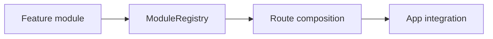

# frontend-modular-framework

Modular React/TypeScript architecture starter emphasizing feature boundaries and route composition.

## Why This Exists

To demonstrate maintainable frontend scaling patterns beyond single-folder component sprawl.

## Architecture



## Project Layout

- `src/features/` route-level feature modules
- `src/framework/` registry + composition logic
- `src/components/` shared UI primitives
- `tests/` behavior tests
- `docs/` architecture + ADRs

## Usage

```bash
npm install
npm run lint
npm test
```

## Roadmap

- Add lazy-loaded feature registration
- Add route guards and permission model
- Add design-token package integration
