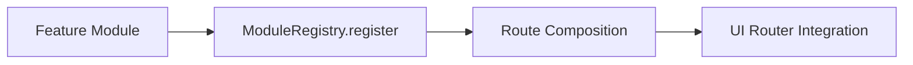

# Architecture

## Layout Strategy

- `src/features`: domain-level route modules.
- `src/framework`: composition/runtime layer.
- `src/components`: reusable UI primitives.
- `src/shared`: cross-cutting utilities.

## Review Focus

- Prevent route collisions at registration time.
- Keep features decoupled from registry internals.
- Keep framework layer thin and predictable.
